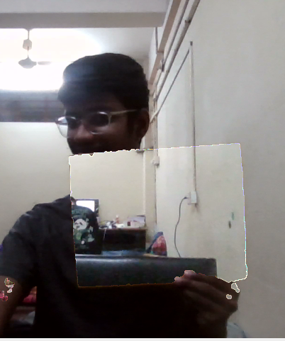
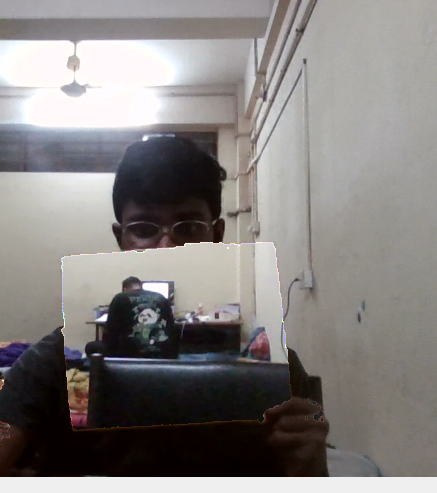

# 🪄 Invisible Book — OpenCV Color-Based Invisibility

> A real-time computer vision project that creates an **invisibility effect** by detecting a target object's color and replacing it with the corresponding pixels from a previously captured background frame.

Built using **Python, OpenCV, NumPy, HSV color segmentation, image masking, and bitwise image operations**.

---

## 📸 Demo

### HSV Detection



### Invisible Book Effect



---

## 🧠 How It Works

The project uses a simple but powerful computer vision technique:

```text
Webcam
   ↓
Capture background
   ↓
Capture live frame
   ↓
Convert BGR → HSV
   ↓
Detect target color
   ↓
Create binary mask
   ↓
Clean the mask
   ↓
Remove target object from live frame
   ↓
Insert background into the detected region
   ↓
Display the final frame
```

The result is an illusion in which the selected object appears to become invisible.

---

# 🔬 Computer Vision Concepts Used

## 1. OpenCV

The project uses **OpenCV (`cv2`)** for real-time computer vision operations, including:

* Webcam capture
* Color-space conversion
* Image masking
* Blurring
* Morphological operations
* Bitwise operations
* Image display
* Interactive trackbars

---

## 2. BGR Color Space

Images captured by OpenCV are represented in **BGR** format rather than RGB.

Each pixel contains three components:

```text
B → Blue
G → Green
R → Red
```

The live camera frame is initially represented in this format.

---

## 3. HSV Color Space

For color-based object detection, the project converts the image from BGR to HSV:

```python
hsv = cv2.cvtColor(frame, cv2.COLOR_BGR2HSV)
```

HSV represents colors using:

| Component          | OpenCV Range | Meaning                |
| ------------------ | -----------: | ---------------------- |
| **H — Hue**        |      `0–179` | Basic color            |
| **S — Saturation** |      `0–255` | Color intensity/purity |
| **V — Value**      |      `0–255` | Brightness             |

HSV is useful for this project because the target object's color can be isolated using numerical ranges.

---

## 4. HSV Thresholding

The target object is detected using:

```python
mask = cv2.inRange(hsv, lower_hsv, upper_hsv)
```

This checks every pixel and determines whether its HSV value lies inside the selected range.

Conceptually:

```text
Inside HSV range  → White (255)
Outside range     → Black (0)
```

The resulting image is called a **binary mask**.

For example:

```text
Target object     → WHITE
Everything else   → BLACK
```

---

## 5. HSV Range Selection

The detector uses two HSV boundaries:

```python
lower_hsv = np.array([H_low, S_low, V_low])
upper_hsv = np.array([H_high, S_high, V_high])
```

A pixel is considered part of the target object when:

```text
H_low ≤ H ≤ H_high
S_low ≤ S ≤ S_high
V_low ≤ V ≤ V_high
```

The HSV values are not universal. They depend on:

* Object material
* Lighting
* Camera
* Exposure
* Shadows
* White balance
* Background

Therefore, this project includes `hsvDetector.py` to help determine suitable HSV ranges experimentally.

---

## 6. HSV Detector

`hsvDetector.py` is used to inspect the HSV values of the target object.

Instead of guessing values, run the detector and click different points on the object.

For example:

```text
HSV: (25, 15, 235)
HSV: (28, 20, 228)
HSV: (30, 12, 242)
```

Sample points from:

* Bright areas
* Dark areas
* Different folds
* Different parts of the object
* Areas under slightly different lighting

Based on the observed values, choose a suitable lower and upper HSV range with some margin.

---

## 7. Trackbars

`InvisibleBook.py` contains OpenCV trackbars that allow the HSV thresholds to be adjusted while the program is running.

The six parameters are:

```text
Lower Hue
Upper Hue

Lower Saturation
Upper Saturation

Lower Value
Upper Value
```

They are useful for **fine-tuning** the previously determined HSV range.

The trackbars do not perform the detection themselves. They simply provide a convenient interface for changing the numerical HSV thresholds.

---

## 8. Median Blur

The binary mask can contain small isolated noise caused by camera noise and imperfect color detection.

The project uses:

```python
mask = cv2.medianBlur(mask, 3)
```

Median filtering helps remove small noise while preserving the general shape of the detected region.

---

## 9. Morphological Dilation

The project uses:

```python
kernel = np.ones((3, 3), np.uint8)

mask = cv2.dilate(mask, kernel, 5)
```

Dilation expands the detected white regions.

This helps compensate for small gaps around the target object's boundaries and produces a more complete mask.

---

## 10. Binary Mask

The mask acts like a switch:

```text
255 → use this region
0   → ignore this region
```

The project creates both:

```python
mask
```

and its inverse:

```python
mask_inv = 255 - mask
```

Therefore:

```text
mask
┌──────────────────────┐
│ Target     → WHITE   │
│ Everything → BLACK   │
└──────────────────────┘

mask_inv
┌──────────────────────┐
│ Target     → BLACK   │
│ Everything → WHITE   │
└──────────────────────┘
```

---

## 11. Bitwise Operations

OpenCV's `bitwise_and()` is used to selectively keep pixels.

For example:

```python
cv2.bitwise_and(frame_channel, mask_inv)
```

keeps the parts of the live frame outside the detected target region.

The same technique is applied to the captured background.

---

## 12. Background Replacement

This is the core of the invisibility effect.

At the beginning, the program captures a frame without the target object:

```python
init_frame
```

This becomes the reference background.

Later:

```text
Current frame
      +
Original background
      +
Color mask
      ↓
Final image
```

The current target region is removed and replaced with the corresponding region from the original background.

Because the background looks similar to what is actually behind the object, the object appears to disappear.

---

# 🚀 Installation

Make sure Python 3 and the required packages are installed.

```bash
pip install opencv-contrib-python numpy
```

Verify OpenCV:

```bash
python3 -c "import cv2; print(cv2.__version__)"
```

---

# ▶️ Usage

## Step 1 — Determine the HSV values

Open:

```text
hsvDetector.py
```

Run it:

```bash
python3 hsvDetector.py
```

Your webcam will open.

Place the object you want to make invisible in front of the camera.

### Click different points on the object

Click several random points across the object.

For example:

```text
        ┌─────────────────┐
        │      OBJECT     │
        │                 │
        │   ●        ●    │
        │        ●        │
        │ ●           ●   │
        │      ●          │
        └─────────────────┘
```

Record the HSV values displayed for those points.

Do not rely on a single pixel. Sample multiple locations because lighting, shadows, folds, and camera noise can cause the HSV values to vary.

---

## Step 2 — Determine the lower and upper HSV limits

Suppose your samples give approximately:

```text
H: 20 – 35
S: 5  – 25
V: 190 – 250
```

Don't necessarily use the exact minimum and maximum.

Give the range some margin, for example:

```python
lower_hsv = np.array([15, 0, 175])
upper_hsv = np.array([40, 40, 255])
```

The correct values depend on your particular object and lighting conditions.

---

## Step 3 — Open `InvisibleBook.py`

After determining a suitable HSV range, open:

```text
InvisibleBook.py
```

Find:

```python
upper_hsv = np.array([
    upper_hue,
    upper_saturation,
    upper_value
])

lower_hsv = np.array([
    lower_hue,
    lower_saturation,
    lower_value
])
```

If using fixed values, update the corresponding HSV limits according to the values determined with `hsvDetector.py`.

---

## Step 4 — Start the invisibility program

Run:

```bash
python3 InvisibleBook.py
```

### Important

When the program starts, it first captures the background.

**Keep the target object/book/cloak outside the camera's view during this stage.**

The captured frame becomes the reference background.

After the background has been captured:

```text
Background captured
        ↓
Enter the frame
        ↓
Target color detected
        ↓
Target region replaced
        ↓
Invisibility effect
```

---

## Step 5 — Fine-tune using the trackbars

Once the program is running, use the HSV trackbars to make small adjustments.

The trackbars control:

```text
Upper Hue
Upper Saturation
Upper Value

Lower Hue
Lower Saturation
Lower Value
```

The HSV detector should be used to determine the **initial range**, while the trackbars can then be used for **small real-time adjustments**.

This is generally easier than trying to discover the entire HSV range using the sliders alone.

---

# 🗂️ Project Structure

```text
InvisibleBook/
│
├── hsvDetector.py
├── InvisibleBook.py
│
├── screenshots/
│   ├── screenshot1.png
│   └── screenshot2.png
│
├── .gitignore
└── README.md
```

### `hsvDetector.py`

Utility program for sampling and inspecting HSV values from the target object.

### `InvisibleBook.py`

Main real-time invisibility application.

### `screenshots/`

Contains screenshots demonstrating the project.

### `.gitignore`

Prevents unnecessary Python-generated files and local environments from being committed.

---

# ⚙️ Core Algorithm

The main pipeline can be summarized as:

```text
                Webcam
                  │
                  ▼
          Capture current frame
                  │
                  ▼
             BGR → HSV
                  │
                  ▼
          HSV color threshold
                  │
                  ▼
             Binary mask
                  │
          ┌───────┴────────┐
          ▼                ▼
      Mask inverse        Mask
          │                │
          ▼                ▼
 Current frame         Background
 without object       in object region
          │                │
          └───────┬────────┘
                  ▼
             Bitwise OR
                  │
                  ▼
             Final image
                  │
                  ▼
        "Invisible" object
```

---

# ⚠️ Limitations

This technique is an **optical illusion based on color segmentation**, not actual object recognition or physical invisibility.

Its performance depends on:

* Stable lighting
* A reasonably distinct target color
* A relatively static background
* Appropriate HSV thresholds
* Camera quality
* Minimal movement of the background

### Background movement

The system assumes that the background captured at the beginning remains mostly unchanged.

If an object in the background moves after the initial frame is captured, the replacement region may contain an outdated version of that background.

### Similar-colored objects

If another object in the scene has a similar HSV range, it may also be detected as part of the target.

This is especially important for low-saturation colors such as white, gray, and some shades of brown.

---

# 🔮 Possible Future Improvements

* Automatic HSV range estimation from selected regions
* Interactive rectangular/ROI-based color sampling
* Automatic background capture countdown
* Improved mask cleaning using erosion and morphological opening/closing
* Better handling of shadows and lighting changes
* Automatic background subtraction
* Real-time FPS display
* GUI-based HSV calibration
* More robust segmentation using machine-learning-based object detection

---

# 📚 Key Takeaway

This project demonstrates how a relatively small number of computer vision concepts can be combined to create a visually impressive real-time application:

```text
Color Space
     +
HSV Thresholding
     +
Binary Masks
     +
Morphological Processing
     +
Bitwise Operations
     +
Background Replacement
     ↓
Real-Time Invisibility Effect
```

The project is primarily intended as a practical introduction to **OpenCV image processing and color-based segmentation**.

---

## 🛠️ Technologies Used

* **Python**
* **OpenCV**
* **NumPy**
* **HSV Color Space**
* **Image Segmentation**
* **Morphological Image Processing**
* **Bitwise Image Operations**
* **Real-Time Computer Vision**
* **Webcam Processing**
